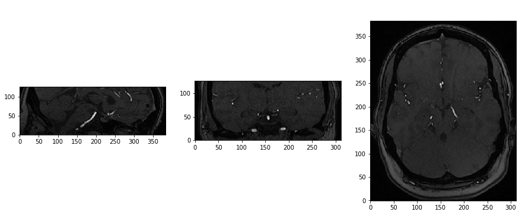

# Multimodal Fusion Strategies for Outcome Prediction in Stroke

This repository contains the implementation and evaluation of a clinical predictors based MLP model, a neuroimaging based CNN model, as well as two multimodal fusion strategies based on neural networks for combining clinical and neuroimaging data for predicting stroke outcome in acute-ischemic patients.

## Publication

## Data
313 patients with acute ischemic stroke from the 1000plus study were included. Currently the data cannot be made publicly accessible due to data protection.

__Inputs:__ 

    1. Clinical Data (7 predictors: 2 continuous, 5 categorical)
    AD_NIH: NIHSS at admission
    AT_LY: thrombolysis
    CH: history of cardiac diseases
    DG_SEX: gender
    RF_DM: diabetes
    RF_HC: hypercholesterolemia
    DG_AG: age
    
    2. Neuroimaging Data (156x192x64 voxels)
    3D Raw TOF-MRA scans

__Output:__ 3 months post-stroke mRS score (good (mrs<=2) : 226 patients , bad (mrs>=3) : 87 patients)

__Exclusion Criteria:__

Patients with no mRS information as well as missing or distorted acute TOF-MRA scans were excluded. Clinical predictors with more than 5% missing values were excluded. Categorical clinical predictors with a yes/no ratio larger than 1/4 were excluded, in order to prevent category imbalance.                               

The table below presents the clinical characteristics of the 1000plus dataset.

| Clinical Information             | Value       | Clinical Information           | Value    | 
|----------------------------------|-------------|--------------------------------|----------|
| Median age (IQR)                 | 72.0 (16.0) | Cardiac history (yes/ no)      | 87/ 226  | 
| Median Initial NIHSS (IQR)       | 3 (4)       | Diabetes (yes/ no)             | 84/ 229  | 
| Thrombolysis (yes/ no)           | 58/ 255     | Hypercholesterolemia (yes/ no) | 187/ 126 |  
| Sex (Females/ males)             | 197/ 116    | 								                |          |

The figure below shows the middle slices of a TOF-MRA image taken from the sagittal, coronal and horizontal planes.

## Methods:

### Data Preprocessing
1. Clinical Data: The continuous predictors were centered using zero-mean unit-variance normalization. Missing values were imputed using mean imputation.

2. Imaging Data: Images were resized from 312x384x127 to 156x192x64 voxels due to memory constraints. The voxel intensity values were centered using zero-mean unit-variance normalization. Images were loaded into a numpy array and saved as a compressed numpy file (.npz) to be used as input to train the model. The array has dimensions (313x156x192x64x1) where the final dimension indicates the number of channels (1). The size of the compressed file was around 4,5GB.

### Clinical Framework: Multilayer Perceptron (MLP)
The clinical data was modeled using an MLP with a single  fully  connected  (FC) hidden layer. The hidden layer  neurons  were  rectified linear units (ReLUs). L2 norm regularization was used in the hidden and output layer neurons. Dropout was used only on the hidden layer neurons. The number of neurons in the hidden layer was chosen during model tuning.

### Neuroimaging Framework: Convolutional Neural Network (CNN)
The 3D imaging data was modeled using a 3D convolutional neural network (CNN) consisting of three convolutional blocks followed by a single FC layer. The figure below illustrates the architecture of the CNN used in this work. The architecture consists of three convolutional and three max pooling layers followed by an FC layer. Convolutional and FC layer neurons were ReLUs. L2 norm regularization was used in the convolutional, FC and output layer neurons. Dropout was used only on the FC layer neurons. Filter size, filter stride, pooling size, number of filters in the convolutional layers and number of neurons in the FC layer were chosen during model tuning.

### Multimodal Framework: Extracted Features and End-to-end
The two multimodal frameworks have the same architectural design: Penultimate layer outputs from each unimodal network was  first fed into an FC layer. This embedded the high dimensional imaging data into a lower dimension and vice versa for the clinical data. The outputs from these embeddings were then concatenated and fed to a final FC layer followed by the
output layer.

#### Extracted features strategy:
The framework is trained using the learned features from the unimodal networks as input: The weights in the penultimate layers of the trained CNN and MLP are frozen and only the following FC layers are trained. All FC layer neurons were ReLUs.
L2 norm regularization and dropout was used in the FC layers. The number of neurons in the embedding and final FC layers were chosen during model tuning.

#### End-to-end strategy:
The framework was trained end-to-end on both data modalities simultaneously. Convolutional and FC layer neurons were ReLUs. L2 norm regularization was used in the convolutional, FC and output layer neurons. Dropout was used only on the FC layer neurons. For the CNN part filter size, filter stride and pooling size was set to (3x3x3), (1x1x1) and (3x3x3) respectively. The number of filters were set to 16,32,64 for the three convolutional layers and the number of neurons in the FC layer was set to 128.   The number of neurons in the MLP hidden layer, the embedding and the final FC layers were chosen during model tuning.

The figure below illustrates all four frameworks.

### Model Training
Binary cross-entropy loss, was selected as the loss function. Loss was minimized using the Adaptive Moment Estimation (Adam) optimizer. Initial weights were sampled from a Glorot uniform distribution. A Softmax function was used as the output layer activation. Early stopping was introduced during training in order to prevent over-fitting: training stopped once the
improvement in validation loss was below a specified value.

### Model Selection

#### Training-Validation-Test Sets
The data was randomly split into three subsets: training, validation and test with 200, 50 and 63 patients in each respectively. In order to account for data variability,the random selection of training, validation and test sets was repeated five times resulting in five different splits. 

#### Grid Search
The models were tuned, i.e best hyperparameters were selected, using gridsearch: Models  were  trained  and  evaluated  on  the training and validation sets respectively for each hyper-parameter combination. The hyper-parameter combination that
yielded best model performance on the validation set was chosen for final training. Same sets were used for all frameworks to achieve comparable results.

Model selection was repeated for the five training-validation-test splits, resulting in five models for each framework.

### Model Evaluation
Model performances were measured on the final training (combined training and validation) and test sets of each split using Area under the Curve (AUC) score. Final training and evaluation was repeated 100 times for each split and the median and interquartile range (IQR) over the 100 training and test AUC scores was used as the final performance measure. Additionally, a non-parametric paired t-test, i.e. Wilcoxon signed rank test, was performed on test performances to compare the multimodal frameworks (i.e. end-to-end and feature extraction) to the clinical data driven MLP network. 

## Results:

### Performance Results

The table below shows the test and training performances by median and interquartile range (IQR) calculated over 100 training and test runs for each split. 

(a) Test (AUC)

| Framework          | Split 1     | Split 2     | Split 3     | Split 4     | Split 5     | Splits mean |
|--------------------|-------------|-------------|-------------|-------------|-------------|-------------|
| CNN                | 0.61 (0.05) | 0.76 (0.03) | 0.68 (0.03) | 0.68 (0.04) | 0.67 (0.2)  | 0.68        |
| MLP                | 0.70 (0.05) | 0.76 (0.02) | 0.80 (0.01) | 0.71 (0.06) | 0.78 (0.05) | 0.75        |
| Extracted features | 0.60 (0.02) | 0.78 (0.01) | 0.78 (0.02) | 0.76 (0.01) | 0.83 (0.01) | 0.75        |
| End-to-end         | 0.71 (0.04) | 0.78 (0.02) | 0.79 (0.03) | 0.73 (0.05) | 0.81 (0.04) | 0.76        |

(b) Training (AUC)

| Framework          | Split 1     | Split 2     | Split 3     | Split 4     | Split 5     | Splits mean |
|--------------------|-------------|-------------|-------------|-------------|-------------|-------------|
| CNN                | 0.97 (0.04) | 0.99 (0.004)| 1.00 (0)    | 0.94 (0.08) | 0.89 (0.3)  | 0.96        |
| MLP                | 0.81 (0.05) | 0.85 (0.01) | 0.87 (0.004)| 0.82 (0.03) | 0.83 (0.03) | 0.84        |
| Extracted features | 0.97 (0.004)| 0.96 (0.006)| 0.99 (0.001)| 0.88 (0.007)| 0.99 (0.001)| 0.96        |
| End-to-end         | 0.90 (0.06) | 0.90 (0.07) | 0.91 (0.06) | 0.92 (0.08) | 0.87 (0.08) | 0.90        |

The figure below illustrates the test (blue) and training (orange) performance of the different frameworks. The markers show the median AUC over 100 runs and the error bars represent interquartile range (IQR).

### Significance

The table below shows the Wilcoxon signed rank test p values on test performances over 100 runs. The test compares a) end-to-end against the MLP and b) extracted features against the MLP.

| Frameworks                 | Split 1     | Split 2     | Split 3     | Split 4     | Split 5     | 
|----------------------------|-------------|-------------|-------------|-------------|-------------|
| Extracted features vs. MLP | 7e-18       | 3e-13       | 6e-16       | 4e-16       | 1e-17       | 
| End-to-end vs. MLP         | 5e-04       | 3e-11       | 5e-03       | 6e-04       | 4e-08       | 

## License
This project is licensed under the [MIT license](LICENSE).

